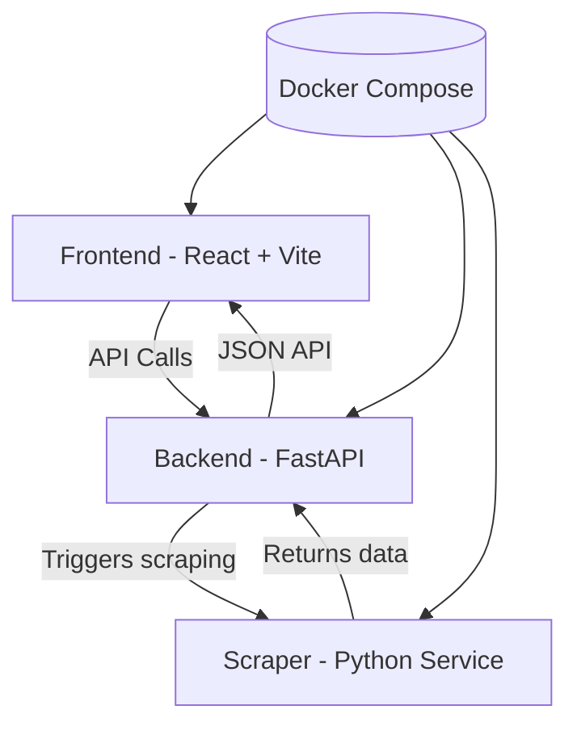

# 🎬 Gnometech single youtube video scraper (Dockerized Microservices Project)

A full-stack, containerized video data platform built with **React (Vite)**, **FastAPI**, and a Python-based **scraper service**, orchestrated via Docker Compose.

---

## 🧠 Overview

This project is a modular system designed to:

- Scrape video data (YouTube-based or similar sources)
- Serve processed data via a FastAPI backend
- Display results in a modern React frontend
- Run everything in isolated Docker containers

---

## 🏗️ System Architecture



---

## 🧱 Services

### 🎨 Frontend (`yt-frontend`)
- Built with **React 18 + Vite**
- Runs on port `5173`
- Handles UI and data visualization

**Scripts:**
```json
"dev": "vite",
"build": "vite build",
"preview": "vite preview"
```

---

### ⚙️ API (`yt-api`)
- Built with **FastAPI**
- Runs on port `8000`
- Handles requests between frontend and scraper

---

### 🕷️ Scraper (`yt-scraper`)
- Python-based service
- Uses `requests`, `yt-dlp`, and related tooling
- Runs continuously or on-demand
- Extracts video metadata/data

---

### 📊 DevOps Layer
- Docker Compose orchestration
- Portainer included for container management

| Service     | Port  |
|-------------|------|
| Frontend    | 5173 |
| API         | 8000 |
| Portainer   | 9000 |

---

## 🔄 Data Flow

```
User → React UI → FastAPI → Scraper → FastAPI → React UI
```

---

## 🐳 Running the Project

### Build & Start Everything
```bash
docker compose up -d --build
```

### View Containers
```bash
docker ps
```

### View Logs
```bash
docker logs yt-frontend
docker logs yt-scraper
docker logs yt-api
```

---

## ⚠️ Common Issues

### ❌ Missing `npm start`
- Fixed by using **Vite instead of CRA (Create React App)**
- Correct entry point is `npm run dev`

### ❌ Python missing dependencies
- Fixed via `requirements.txt` in Docker build

### ❌ Container restarting
- Usually caused by missing dependencies or wrong entry command

---

## 🧰 Tech Stack

**Frontend:**
- React 18
- Vite

**Backend:**
- FastAPI
- Uvicorn

**Scraper:**
- Python 3.11
- yt-dlp
- requests

**DevOps:**
- Docker
- Docker Compose
- Portainer

---

## 🧭 Notes for Developers

- Frontend must use `npm run dev` (not `start`)
- Ensure `requests` is installed in scraper container
- Avoid mixing CRA and Vite expectations
- Use Docker logs for debugging container restarts

---

## 📸 Suggested Improvements

- Add UI dashboard charts (views, uploads, trends)
- Cache scraped data in DB (PostgreSQL or SQLite)
- Add rate limiting for scraper
- Replace polling with event-driven updates (WebSockets)

---

## 🚀 Future Ideas

- User authentication
- Playlist tracking
- AI-based video summarization
- Multi-platform scraping (TikTok, Instagram)

---

## 🧩 Project Identity

> A lightweight, containerized video intelligence pipeline built for experimentation, scraping, and dashboard visualization.

---

## 📦 Author Notes

If containers restart:
```bash
docker logs <container>
```
Then fix dependency or entrypoint issues before rebuilding.

---

END OF DOCUMENT

